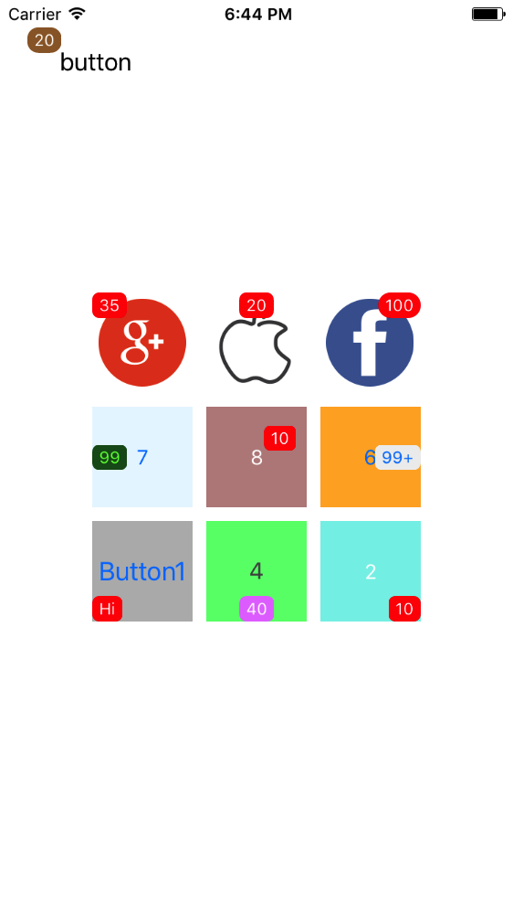
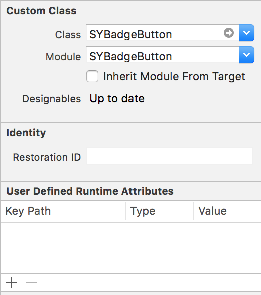
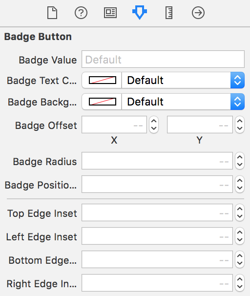

# SYBadgeButton
SYBadgeButton can customize badge button that you want.

## Features

- [x] It can be implemented in storyboard.
- [x] Easy to use, highly customizable.
- [x] All positions are supportable.

### Screenshots



## Requirements

- iOS 8.0+
- Swift 4

## Installation

### CocoaPods

[CocoaPods](http://cocoapods.org) is a dependency manager for Cocoa projects. You can install it with the following command:

```bash
$ gem install cocoapods
```

To integrate SYBadgeButton into your Xcode project using CocoaPods, specify it in your Podfile:

```ruby
source 'https://github.com/CocoaPods/Specs.git'
platform :ios, '8.0'
use_frameworks!

target '<Your Target Name>' do
	pod 'SYBadgeButton'
end
```

Then, run the following command:

```bash
$ pod install
```

## Usage

### Code-less Storyboard Implementation

First, add custom class that is ```SYBadgeButton``` to your button:



 And you can see customized properties in attributes inspector:



### Code Implementation

First:

```swift
import SYBadgeButton
```

Then, initialize your button:

```swift
let rect = CGRect(x: 20, y: 20, width: 100, height: 50)
let badgeButton = SYBadgeButton(frame: rect)
badgeButton.setTitle("button", for: .normal)
badgeButton.setTitleColor(UIColor.black, for: .normal)
view.addSubview(badgeButton)
```

Add your badge Value:

```swift
badgeButton.badgeValue = "20"
```

Customize badge color:

```swift
badgeButton.badgeBackgroundColor = UIColor.brown
badgeButton.badgeTextColor = UIColor.white
```

Have several of positions:

```swift
// This is topLeft position, and default is topRight position by 0
badgeButton.badgePositionIndex = 1
```

Also you can use badge offset and edge inset:

```swift
// Custom offset and edge inset
badgeButton.badgeOffset = CGPoint(x: 3, y: 3)
badgeButton.leftEdgeInset = 10
badgeButton.rightEdgeInset = 10
badgeButton.topEdgeInset = 5
badgeButton.bottomEdgeInset = 5
```

## Licence
SYBadgeButton is available under the MIT license. See the [MIT License](LICENSE) for more info.
